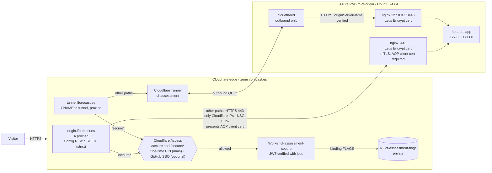

# Cloudflare Application Services — take-home assignment

Live implementation on the zone **iforecast.es** (zone on the Cloudflare **Free** plan, Zero Trust **Free**; the
account's other paid subscriptions are not used by this assessment) with an Azure VM as origin.
The configuration is codified in this repository: Terraform for the Cloudflare resources (imported,
plan *No changes*), scripts for the VM and origin, Wrangler for the Worker. A few steps remain manual
(certificate issuance, R2 public-access settings, flag upload); see `docs/REPORT.md` §5.

**Status:** all seven requirements are implemented and verified; the test matrix is **18/18**. Requirement 5 adds **GitHub** as a
federated SSO identity provider. The main login method on the Access page is still the **e-mail one-time PIN**
(*Send login code*), so `@cloudflare.com` reviewers do not need a GitHub account. GitHub is optional.

**Report:** [`docs/REPORT.md`](docs/REPORT.md) · **Reviewer guide:** [`docs/ACCESS.md`](docs/ACCESS.md)

| What | URL | Access |
|---|---|---|
| Origin echo (classic proxy, Full strict + per-hostname AOP) | https://origin.iforecast.es/ | Public |
| Origin echo through **Cloudflare Tunnel** | https://tunnel.iforecast.es/ | Public |
| Identity page (Worker) | https://tunnel.iforecast.es/secure | **Cloudflare Access**: `@cloudflare.com` e-mails + the candidate |
| Country flag from private R2 (Worker) | https://tunnel.iforecast.es/secure/ES | Cloudflare Access |

The same `/secure` experience is also served on `origin.iforecast.es/secure` (same Access application).

## How to access (reviewers)

1. Open **https://tunnel.iforecast.es/secure**.
2. Cloudflare Access shows the `iforecast` login page. **Main path:** enter your `@cloudflare.com` address
   in the **Email** field, click **Send login code** and type the code you receive by e-mail. (Optional:
   the *Sign in with: GitHub* button above the form works if your GitHub account's primary e-mail is an
   `@cloudflare.com` address.)
3. You get: `<your e-mail> authenticated at <timestamp> from <COUNTRY>`. Click the country to open
   `/secure/<COUNTRY>`, an SVG flag streamed by the Worker from a **private** R2 bucket.

Any header echo: `curl -H "X-Probe: hello" https://origin.iforecast.es/` (add `?format=text` for plain text).

## Architecture



## How each requirement is met

| # | Requirement | Implementation |
|---|---|---|
| 1 | Origin returning all request headers | `origin/app/headers_app.py` (Python stdlib) as a hardened systemd service on 127.0.0.1:8080, behind nginx. |
| 2 | Proxy through Cloudflare | Proxied `A origin.iforecast.es`; visitors only see Cloudflare anycast IPs. |
| 3 | Non-Cloudflare cert + Full (strict) | Let's Encrypt ECDSA certificate (DNS-01) on nginx; a **Configuration Rule** sets SSL = Full (strict) for the two assessment hosts (the rest of the zone serves unrelated production sites and keeps its own setting). |
| 4 | Cloudflare Tunnel on `tunnel.` | Remotely-managed tunnel; ingress `https://127.0.0.1:8443` with `originServerName` and TLS verification on (Full-strict equivalent inside the tunnel). |
| 5 | SSO IdP in Zero Trust | **GitHub** OAuth identity provider (federated SSO, optional) and **e-mail One-time PIN** (main method for reviewers). The Access app's `allowed_idps` lists both, without instant redirect, so the login page shows both. |
| 6 | Lock down `/secure` + no origin bypass | Access app with destinations `/secure` and `/secure/*`, policy: candidate's e-mail OR `@cloudflare.com`, 24 h session. Bypass prevention in layers: NSG + ufw (443 from Cloudflare ranges only), nginx rejects unknown SNI (`ssl_reject_handshake`), **per-hostname Authenticated Origin Pulls with our own private-CA client cert** (`ssl_verify_client on`), app bound to loopback, Worker re-verifies the Access JWT. |
| 7 | Worker + private R2 | `worker/` (TypeScript, Wrangler): verifies `Cf-Access-Jwt-Assertion` (RS256, issuer, AUD), renders `${EMAIL} authenticated at ${TIMESTAMP} from ${COUNTRY}` as HTML, `/secure/${COUNTRY}` streams `flags/<cc>.svg` from R2 as `image/svg+xml`. workers.dev and preview URLs are disabled. |

## Test cases (evidence in [`docs/evidence/`](docs/evidence))

| Test | Expected | Evidence |
|---|---|---|
| `curl https://68.221.177.94/` | timeout (firewall) | `01-direct-ip.txt` |
| `curl --resolve origin.iforecast.es:443:68.221.177.94 https://origin.iforecast.es/` | timeout | `02-direct-ip-with-sni.txt` |
| Same from inside the VM (firewall bypassed) | TLS alert for unknown SNI; `400 No required SSL certificate was sent` without AOP cert | `09-on-vm-checks.txt` |
| `curl https://origin.iforecast.es/` | 200, all headers incl. `cf-connecting-ip`, `cf-ray` | `03-origin-via-cloudflare.txt` |
| `curl -I http://origin.iforecast.es/` | 301 to HTTPS | `04-origin-http-redirect.txt` |
| `curl https://tunnel.iforecast.es/` | 200 via tunnel (`cf-warp-tag-id`) | `05-tunnel-root.txt` |
| `curl -I https://tunnel.iforecast.es/secure` and `/secure/ES` | 302 to `iforecast.cloudflareaccess.com` | `06`, `07`, `11-worker-deploy-and-access.txt` |
| Forged `Cf-Access-*` headers | still 302 | `11-worker-deploy-and-access.txt` |
| workers.dev URL | 404 (disabled) | `11-worker-deploy-and-access.txt` |
| Browser login (OTP) → identity page → flag | works | `12-e2e-browser-login.txt` |
| Browser login with GitHub → identity page (run by the candidate) | works | `17-final-logins.txt` |
| Mailbox outside the policy requests a code | no code sent, no access | `17-final-logins.txt` |
| Plan and nameserver delegation | Free plans; `iforecast.es` delegated to Cloudflare NS | `18-plan-and-nameservers.txt` |
| Public DNS | Cloudflare IPs only | `08-dns-public.txt` |
| Cloudflare API state | zone untouched, resources as designed | `10-cloudflare-api-state.txt` |
| Worker unit tests | 39 passing (Vitest + workerd) | CI |
| Terraform | 17 resources managed (16 adopted first + GitHub IdP); follow-up plan: *No changes* | `terraform-apply.txt`, `terraform-plan-after.txt` |

## Repository layout

```
origin/                 headers app, systemd unit, nginx site (3 TLS server blocks)
infra/origin/           provision.sh - idempotent VM setup incl. ufw + cloudflared (token as parameter)
infra/azure/            Azure CLI scripts for the VM, NSG and teardown
infra/cloudflare/       Terraform (provider v5): DNS, rules, AOP, tunnel, Access, GitHub IdP, R2, Worker routes
worker/                 Worker (TypeScript, jose, Vitest), wrangler.jsonc, flag upload scripts
docs/change-log.md      every Cloudflare API change with method, endpoint, purpose, result
docs/evidence/          command outputs proving each requirement
.github/workflows/      CI: lint + test on push/PR; manual, opt-in deploy job
```

## Security notes

- No credentials in git: API tokens are passed as process environment at run time only; the tunnel
  token, TLS/AOP private keys and Terraform state stay outside the repository (see `.gitignore`).
- The Access AUD tag, account/zone IDs and resource IDs in this repo are identifiers, not secrets.
- Secret scanning (gitleaks) runs clean on the tree and history.
- Flags: [lipis/flag-icons](https://github.com/lipis/flag-icons), MIT License © Panayiotis Lipiridis
  (assets are stored in R2, not in this repo).
