# Cloudflare Application Services — Technical Report

**Candidate:** Alejandro Forero · **Zone:** `iforecast.es` (zone on the Free plan; see §8 for plan notes) · **Date:** October 2026
**Repository:** https://github.com/aforero22/cloudflare-assessment · Reviewer instructions: [`ACCESS.md`](ACCESS.md)

> Screenshots live in `docs/screenshots/` (browser chrome cropped; the candidate e-mail, the admin IP, the
> Azure subscription and the workers.dev subdomain are blurred, and the account ID is blurred in screenshots — it is an identifier,
> not a credential, and appears in `change-log.md`). Command-line
> evidence lives in [`evidence/`](evidence) and every Cloudflare API change is logged in
> [`change-log.md`](change-log.md).

## Contents

1. [Summary](#1-summary)
2. [Architecture](#2-architecture)
3. [Implementation, requirement by requirement](#3-implementation-requirement-by-requirement)
4. [Security design — defense in depth](#4-security-design--defense-in-depth)
5. [Infrastructure as code and CI](#5-infrastructure-as-code-and-ci)
6. [Use cases](#6-use-cases)
7. [How I filled knowledge gaps](#7-how-i-filled-knowledge-gaps)
8. [Customer experience and friction found](#8-customer-experience-and-friction-found)
9. [Production recommendations](#9-production-recommendations)
10. [Appendix — test matrix](#10-appendix--test-matrix)

---

## 1. Summary

| | |
|---|---|
| Origin echo, classic proxy | https://origin.iforecast.es/ — Full (strict), Let's Encrypt cert, per-hostname Authenticated Origin Pulls |
| Origin echo, Cloudflare Tunnel | https://tunnel.iforecast.es/ — `cloudflared` outbound only, TLS verified to the origin |
| Identity page (Worker) | https://tunnel.iforecast.es/secure — Cloudflare Access (e-mail One-time PIN; GitHub SSO optional): candidate + `@cloudflare.com` |
| Flag from private R2 | https://tunnel.iforecast.es/secure/ES |

All seven requirements are implemented and verified end to end, including real browser logins with the
e-mail One-time PIN and with GitHub (`evidence/12-e2e-browser-login.txt`, `evidence/17-final-logins.txt`).
The test matrix in §10 is **18/18**. Requirement 5 adds **GitHub** as a federated SSO identity
provider. The e-mail One-time PIN is the main login method for `@cloudflare.com` reviewers, and GitHub is
optional (`evidence/15-github-idp.txt`, `evidence/16-idp-order.txt`). The zone already serves unrelated
production sites, so every setting was **scoped to the two assessment hostnames** (Configuration Rule, Redirect Rule, per-hostname
AOP) instead of flipping zone-wide toggles. The configuration is codified: Terraform for the Cloudflare resources (adopted
with `import`, follow-up plan: *No changes*), a provisioning script for the origin, Wrangler for the Worker.
Some steps stay manual and are listed in §5 (certificate issuance, R2 public-access settings, flag upload).

## 2. Architecture

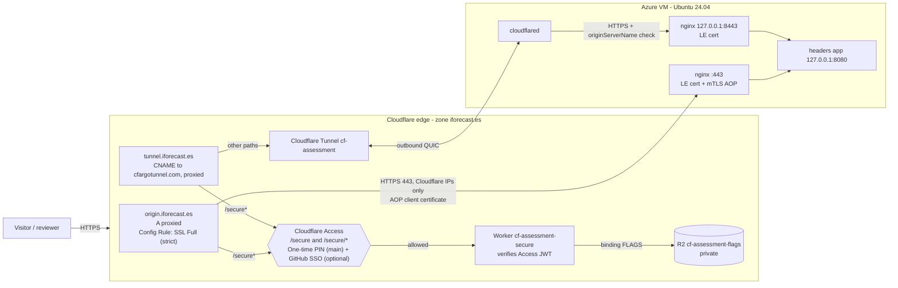
```mermaid
flowchart LR
  U["Visitor / reviewer"] -->|"HTTPS"| EDGE

  subgraph EDGE["Cloudflare edge - zone iforecast.es"]
    O["origin.iforecast.es<br/>A proxied<br/>Config Rule: SSL Full (strict)"]
    T["tunnel.iforecast.es<br/>CNAME to cfargotunnel.com, proxied"]
    ACC{{"Cloudflare Access<br/>/secure and /secure/*<br/>One-time PIN (main) + GitHub SSO (optional)"}}
    W["Worker cf-assessment-secure<br/>verifies Access JWT"]
    R2[("R2 cf-assessment-flags<br/>private")]
    TUN["Cloudflare Tunnel cf-assessment"]
  end

  O -->|"/secure*"| ACC
  T -->|"/secure*"| ACC
  ACC -->|"allowed"| W
  W -->|"binding FLAGS"| R2
  T -->|"other paths"| TUN

  subgraph VM["Azure VM - Ubuntu 24.04"]
    NGX443["nginx :443<br/>LE cert + mTLS AOP"]
    NGX8443["nginx 127.0.0.1:8443<br/>LE cert"]
    CFD["cloudflared"]
    APP["headers app 127.0.0.1:8080"]
  end

  O -->|"HTTPS 443, Cloudflare IPs only<br/>AOP client certificate"| NGX443
  TUN <-->|"outbound QUIC"| CFD
  CFD -->|"HTTPS + originServerName check"| NGX8443
  NGX443 --> APP
  NGX8443 --> APP
```

Two ingress paths reach the same application on purpose: the **classic proxy** path makes Full
(strict) and origin lock-down demonstrable, and the **Tunnel** path is the hostname required by the
assignment and the one protected by Access + Worker.

## 3. Implementation, requirement by requirement

### Pre-requisites — account and zone
Existing Cloudflare account and zone `iforecast.es` (Free plan, active). Existing records (apex, `www`,
other sub-sites, mail) were left untouched; the zone SSL mode stays **Full** for them.
- Plans: the zone is on **Free** and Zero Trust on **Free**; the account's other paid subscriptions (from
  other projects) are not used by this assessment.
- Delegation: the registrar points `iforecast.es` to the Cloudflare nameservers `ian.ns.cloudflare.com` and
  `raphaela.ns.cloudflare.com`; public resolvers (1.1.1.1, 8.8.8.8) return them (`evidence/18-plan-and-nameservers.txt`).

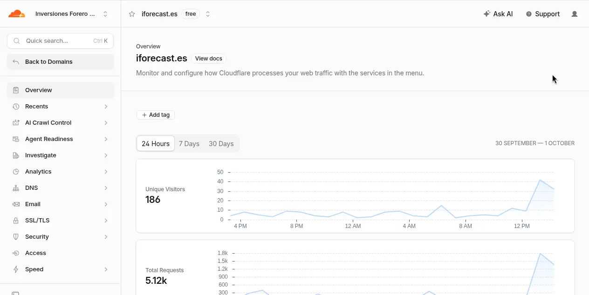

### Requirement 1 — Origin returning all request headers
- Azure VM `vm-cf-origin` (Ubuntu 24.04, Spain Central), created with `infra/azure/deploy.ps1`.
- `origin/app/headers_app.py`: ~90 lines of Python standard library. Any method/path returns every
  request header as pretty JSON (or `?format=text`). Runs as a hardened systemd service
  (`DynamicUser`, `ProtectSystem=strict`, …) bound to **127.0.0.1:8080** only.
- `/secure*` returns 404 at the origin: that path belongs to the Worker.
- Evidence: `evidence/03-origin-via-cloudflare.txt`, `evidence/05-tunnel-root.txt`.

### Requirement 2 — Proxy traffic through Cloudflare
- `A origin.iforecast.es → 68.221.177.94`, **proxied** (orange cloud). Public DNS returns only Cloudflare
  anycast IPs (`evidence/08-dns-public.txt`).
- Responses carry `server: cloudflare`, `cf-ray`; the origin sees `cf-connecting-ip`, `cf-ipcountry`,
  `cf-visitor`, `x-forwarded-for`.
- HTTP→HTTPS: a **Single Redirect rule** scoped to the two hostnames (`evidence/04-origin-http-redirect.txt`).

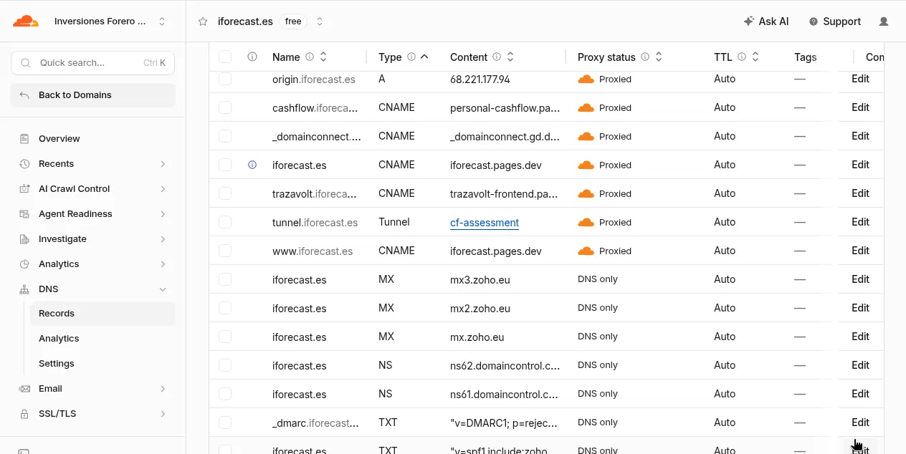

*Note on figure 2:* the two apex `NS ns61/ns62.domaincontrol.com` rows (DNS only) are leftovers copied from the
previous DNS provider when the zone was added. They are not the delegation (see `evidence/18`) and were left
untouched, like every other existing record on this shared zone.
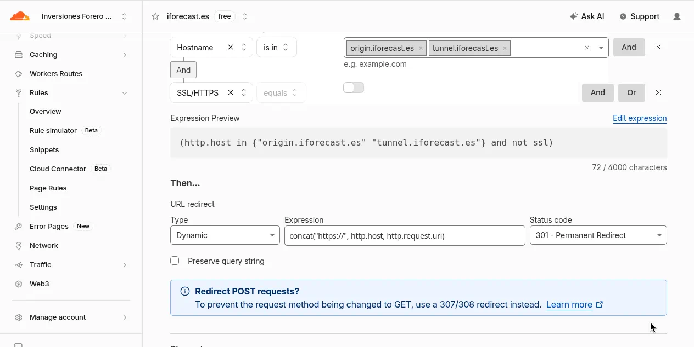

### Requirement 3 — Non-Cloudflare certificate, Full (strict)
- Certificate: **Let's Encrypt** ECDSA P-256 for `origin.iforecast.es` + `tunnel.iforecast.es`, issued with
  the ACME **DNS-01** challenge through the Cloudflare API (no port 80 needed). Issuer LE `YE2`.
- **Configuration Rule** (`http_config_settings`): `http.host in {"origin.iforecast.es" "tunnel.iforecast.es"}`
  → `SSL: Full (strict)`. This gives strict validation for the assessment hosts without changing the
  zone-wide mode used by other production sites.
- In the Tunnel path the zone SSL mode does not apply, so `cloudflared` is configured with
  `originServerName: tunnel.iforecast.es` and `noTLSVerify: false` — the Tunnel equivalent of Full (strict).
- Evidence: `evidence/09-on-vm-checks.txt` (issuer/SAN/dates), `evidence/10-cloudflare-api-state.txt`.

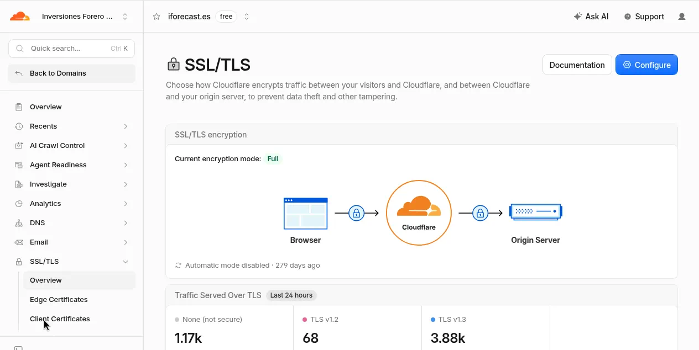
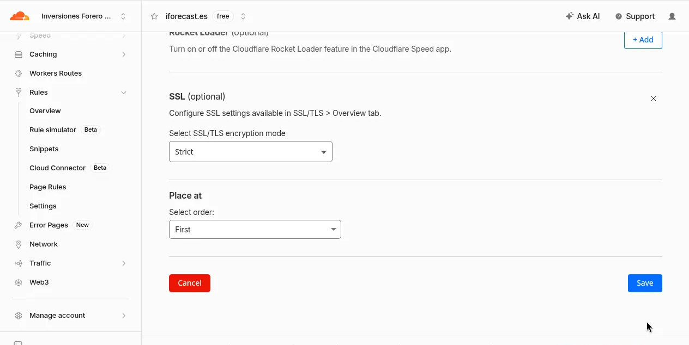

### Requirement 4 — Cloudflare Tunnel on `tunnel.iforecast.es`
- Remotely-managed tunnel `cf-assessment` created via API (`config_src: cloudflare`); `cloudflared`
  installed from Cloudflare's apt repository and registered as a systemd service with the connector token.
- Ingress: `tunnel.iforecast.es → https://127.0.0.1:8443` (dedicated loopback nginx listener with the
  LE certificate), catch-all `http_status:404`. `CNAME tunnel → <tunnel-id>.cfargotunnel.com`, proxied.
- Status **Healthy**; the connector holds 4 connections to Madrid data centers (connections listed in
  `evidence/10-cloudflare-api-state.txt`).
- Evidence: `evidence/05-tunnel-root.txt` (`cf-warp-tag-id` header), `evidence/10-cloudflare-api-state.txt`.

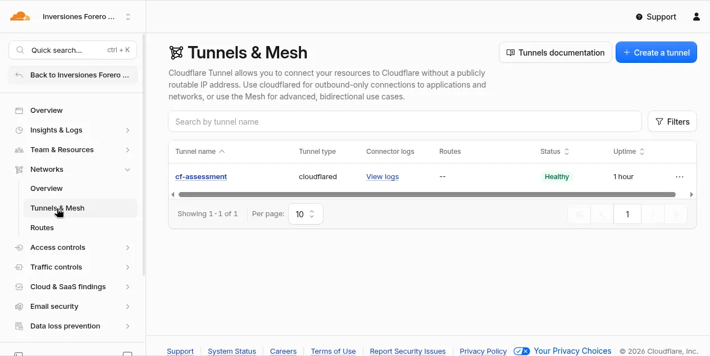
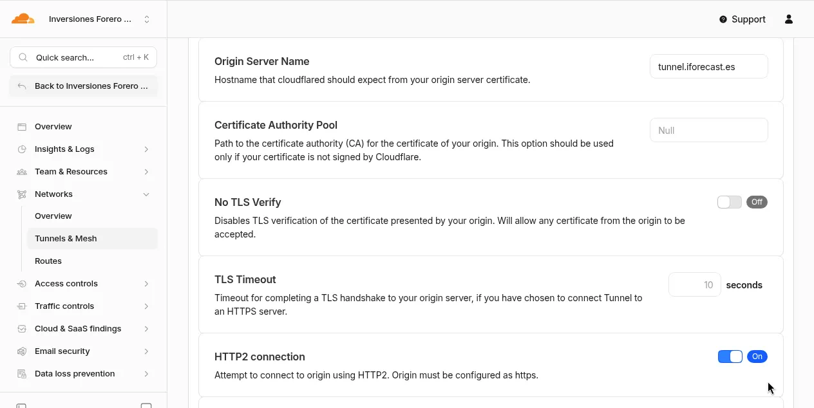

### Requirement 5 — SSO identity provider in Zero Trust
- Team domain `iforecast.cloudflareaccess.com`. Identity providers: **GitHub** (OAuth app
  `iforecast Cloudflare Access`, owned by the candidate's GitHub account, callback
  `https://iforecast.cloudflareaccess.com/cdn-cgi/access/callback`) and **One-time PIN**.
- The **e-mail One-time PIN** is the main login method: any `@cloudflare.com` reviewer can log in without a
  GitHub account. **GitHub** is the federated SSO provider for this requirement and is optional. The Access
  application lists both in `allowed_idps` (`One-time PIN`, `GitHub`) with `auto_redirect_to_identity = false`,
  so the login page offers both (figures 12 and 23). Cloudflare decides the page layout: IdP buttons
  ("Sign in with:") always sit above the e-mail form, and neither the API (`allowed_idps` is a set) nor the
  dashboard has an ordering setting. So GitHub shows first, as a neutral button, and **Send login code** is
  the primary (blue) button. The reviewer guide tells reviewers to use the e-mail form (`evidence/16-idp-order.txt`). The Access policy is unchanged: users are allowed by e-mail (GitHub returns the
  account's primary e-mail), so a GitHub user gets in only if that e-mail matches the policy.
- Verified: the login page's GitHub button points to `github.com/login/oauth/authorize` with the app's
  client ID, and GitHub's sign-in page shows "to continue to iforecast Cloudflare Access"; the
  dashboard IdP test reports "Your connection works!" (`evidence/15-github-idp.txt`). A complete GitHub
  login through to `/secure` (identity page shown) was run by the candidate on 2026-10-01 at 18:17
  Europe/Madrid; the Access authentication log records it with method `github`, allowed
  (`evidence/17-final-logins.txt`).
- Terraform: `cloudflare_zero_trust_access_identity_provider.github` (imported, plan *No changes*). The
  client ID is in code (it is public); the client secret was entered in the dashboard, is never returned
  by the API, is not in git or state, and is excluded with `lifecycle { ignore_changes }`.

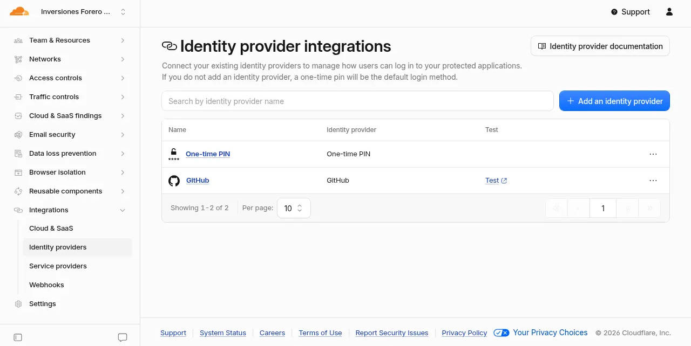
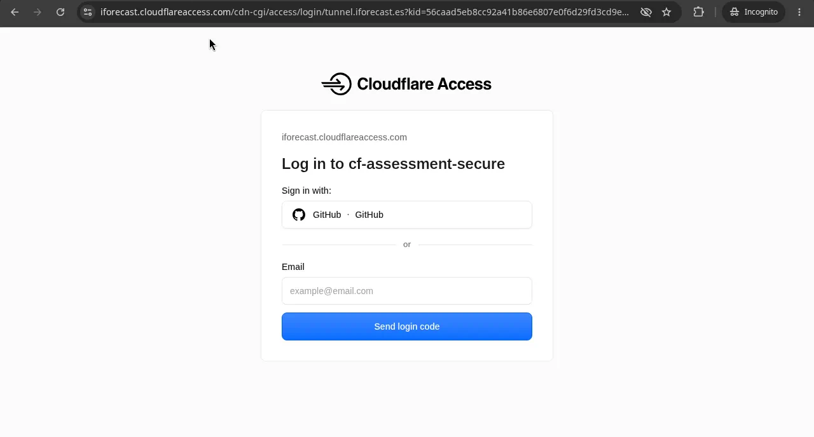

### Requirement 6 — Lock down `/secure` and prevent origin bypass
- Access application `cf-assessment-secure` (self-hosted) with destinations `/secure` **and**
  `/secure/*` on `tunnel.iforecast.es` (and the same two on `origin.iforecast.es`, because the Worker is
  routed there too). Both paths are listed explicitly per host so the protection does not depend on
  path-matching rules (`/secure` alone or `/secure/*` alone was not relied upon); the four Worker routes
  match these four destinations one to one.
- Reusable policy: **Allow** if e-mail = the candidate's address **or** e-mail domain = `cloudflare.com`;
  session 24 h.
- Unauthenticated requests → 302 to the Access login page; forged `Cf-Access-*` headers are ignored
  (`evidence/06`, `07`, `11`). Real login verified (`evidence/12-e2e-browser-login.txt`). Final API
  state of the application, policy and routes: `evidence/13-access-final-state.txt`.
- Denial tested: a login code was requested for a mailbox outside the policy; Cloudflare sent no code
  (codes go only to addresses the policy allows), so there was no access (`evidence/17-final-logins.txt`).
  The policy include list is shown in `evidence/13`.
- Bypass prevention is described in §4; direct-to-IP tests in `evidence/01`, `02`, `09`.

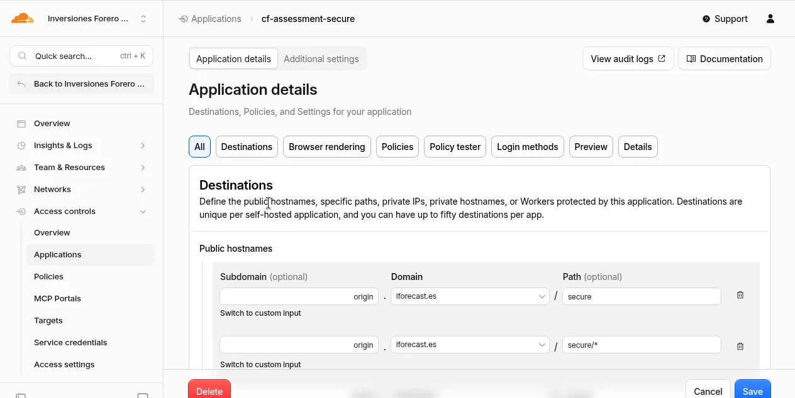
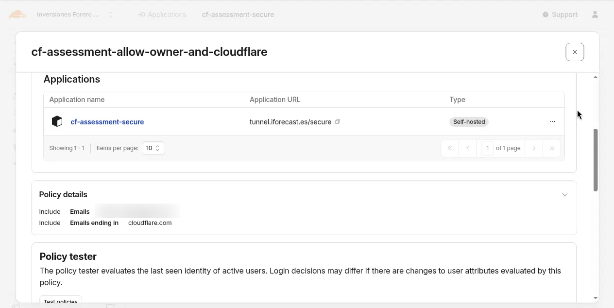
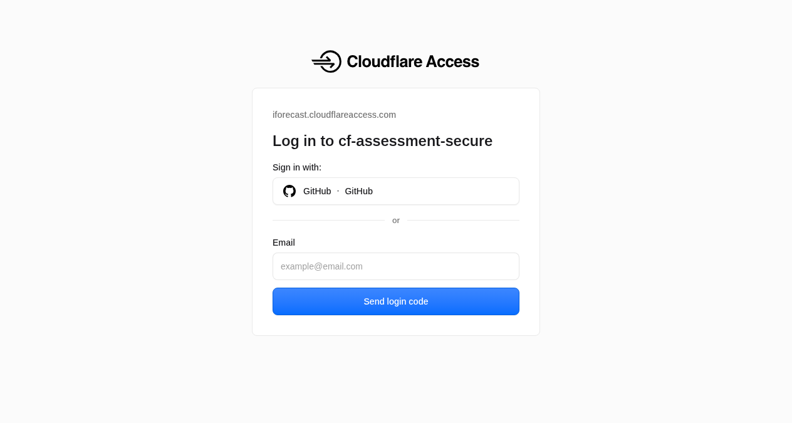
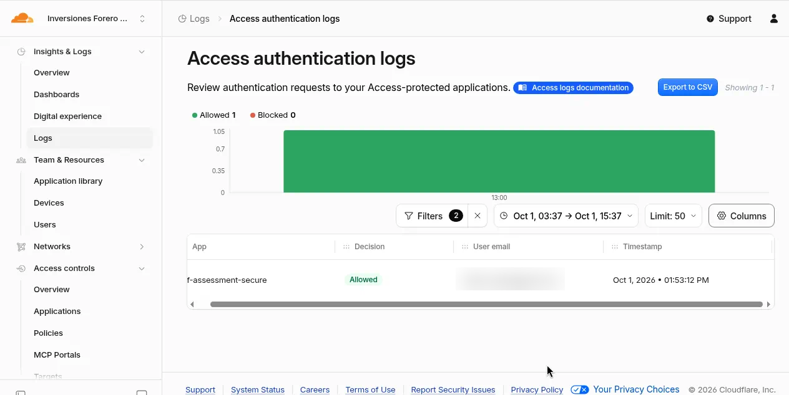
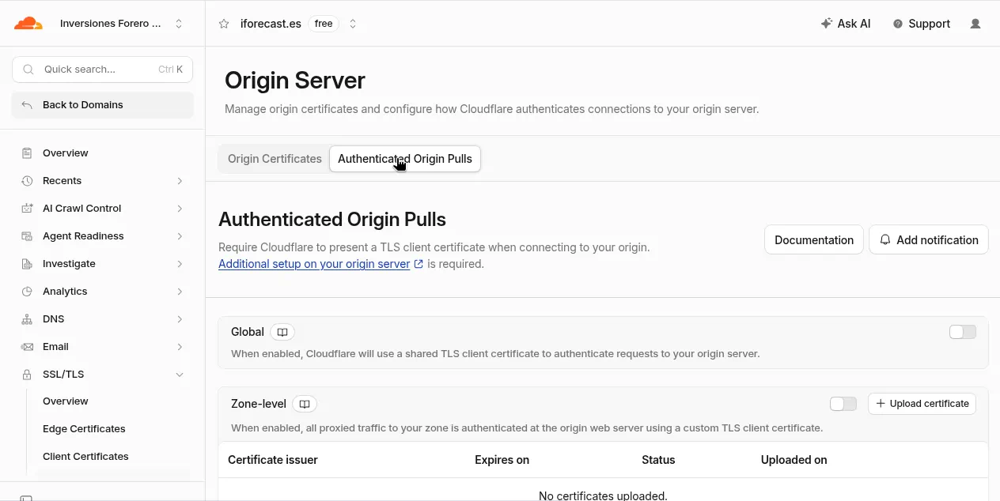

*Figure 06: the dashboard page shows global and zone-level AOP **off**, which is intended. The per-hostname
association for `origin.iforecast.es` (private-CA certificate, status `active`) is managed through the API and
Terraform and is shown in `evidence/10-cloudflare-api-state.txt`.*

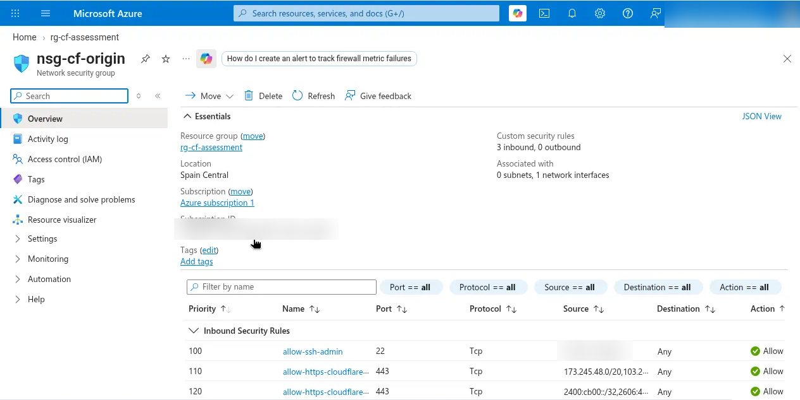

### Requirement 7 — Worker with identity and flag from private R2
- `worker/` (TypeScript, Wrangler 4). Routes `tunnel.iforecast.es/secure` and `/secure/*` (plus origin);
  `workers_dev: false`, `preview_urls: false`.
- **Identity:** verifies `Cf-Access-Jwt-Assertion` with `jose` (RS256, issuer = team domain, audience =
  application AUD, `exp` and `iat` required) against the team JWKS. Email from the verified token
  (if the token has no e-mail claim, the Access identity endpoint is called with that same verified
  token); TIMESTAMP = token `iat` (time of authentication); COUNTRY = `request.cf.country`, computed
  per request.
- **Response (`text/html`):** `<email> authenticated at <ISO timestamp> from <a href="/secure/ES">ES</a>`,
  all values HTML-escaped, strict CSP, `Cache-Control: private, no-store`.
- **Flag (`image/svg+xml`):** `/secure/{CC}` validated against `^[A-Za-z]{2}$`, read from R2 key
  `flags/{cc}.svg` (257 ISO flags from lipis/flag-icons, MIT). Bucket is private: r2.dev disabled and no
  custom domain, so the Worker binding is the only public serving path (account-level S3 API
  credentials could still read it).
- Logs contain only route shape, status and outcome — never e-mail or tokens.
- 39 unit tests (Vitest on the Workers runtime) including forged/expired/wrong-audience tokens.
- Evidence: `evidence/11-worker-deploy-and-access.txt`, `evidence/12-e2e-browser-login.txt`.

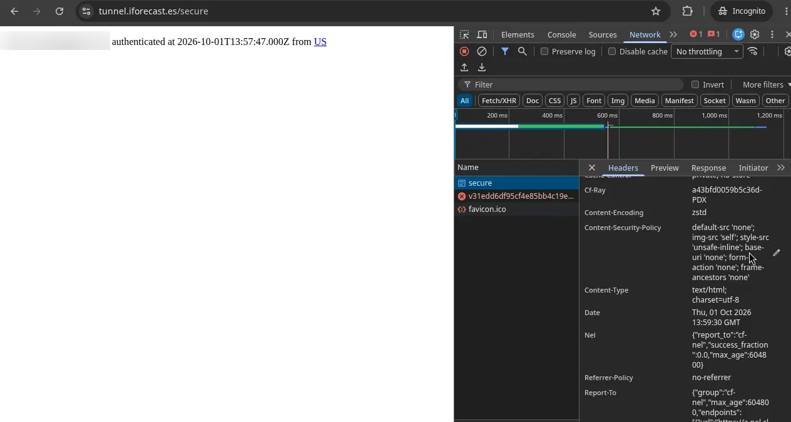

*Figure 13 was captured from a browser whose egress is in the United States, so the sentence reads
`from US` and links to `/secure/US`. COUNTRY is computed per request from `request.cf.country`; the
candidate's own login from Madrid returned `ES` (`evidence/12-e2e-browser-login.txt`).*

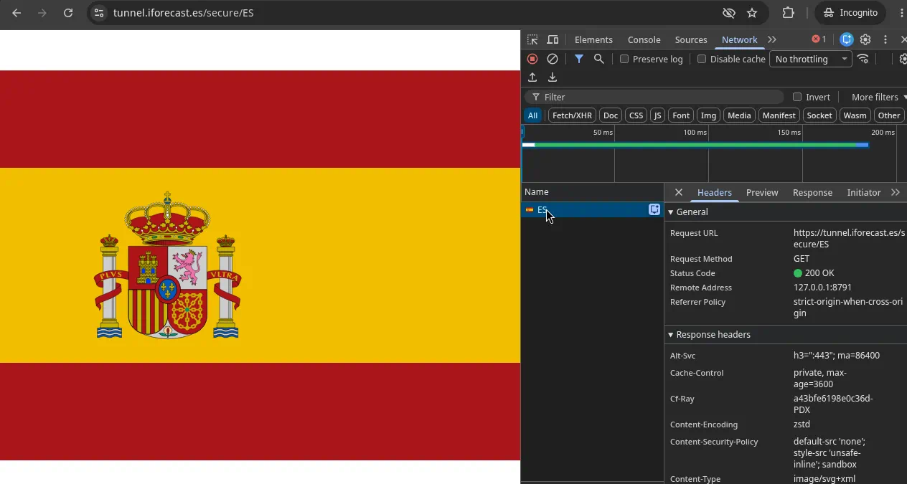

*Figure 14: `/secure/ES` opened directly. Any ISO 3166-1 alpha-2 path works (for example `/secure/US`).*

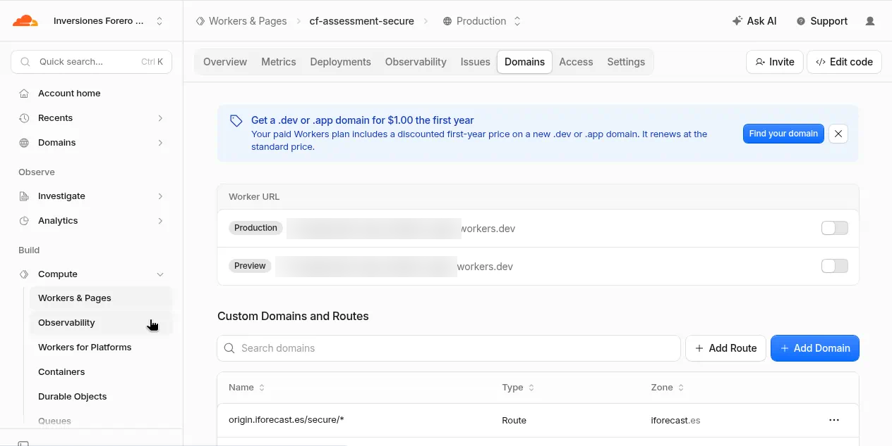
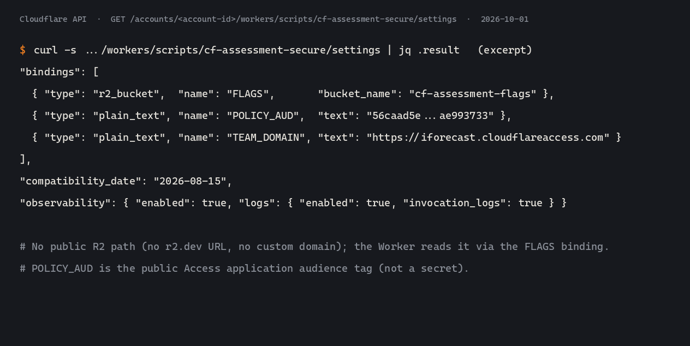
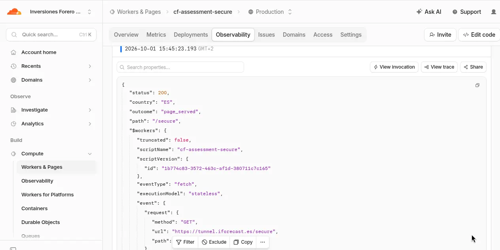
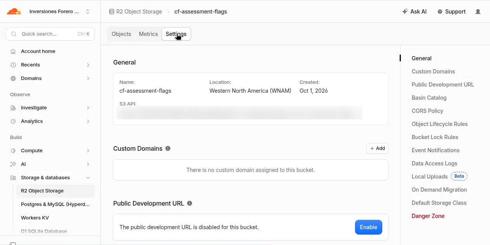
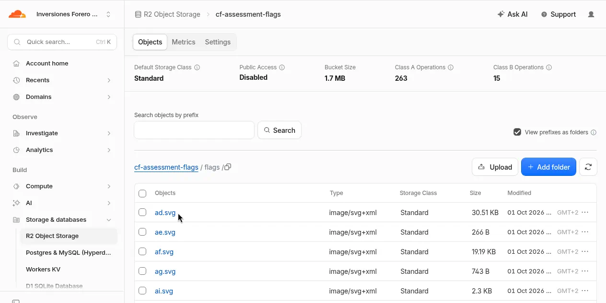

## 4. Security design — defense in depth

| Layer | Control | What it stops | Evidence |
|---|---|---|---|
| Network | Azure NSG + ufw: 443 only from Cloudflare IPv4/IPv6 ranges; SSH only from one admin /32; port 80 closed | Direct scans and connections to the origin IP | `01`, `02`, `09` |
| TLS front door | nginx `default_server` with `ssl_reject_handshake on` | Requests to the raw IP or unknown SNI get a TLS alert, no content | `09` |
| Origin authentication | **Per-hostname Authenticated Origin Pulls** with a client certificate from our own private CA; nginx `ssl_verify_client on` | Anyone without the client cert — including traffic proxied by *other* Cloudflare accounts, which the shared global AOP certificate would not stop | `09` (`400 No required SSL certificate was sent`; Cloudflare requests `ssl_client_verify=SUCCESS`) |
| Transport | Full (strict) via Configuration Rule; Tunnel with `originServerName` verification | MITM between Cloudflare and origin; misissued/expired certs | `03`, `05`, `10` |
| Application exposure | App bound to 127.0.0.1; tunnel listener on loopback only | Exposure of the app port | `09` |
| Identity | Cloudflare Access before the Worker; e-mail OTP (main) or GitHub SSO (optional); policy email + domain | Unauthenticated or unauthorized users | `06`, `07`, `11`, `12` |
| Defense in depth | Worker re-verifies the Access JWT (issuer, AUD, signature, expiry) | Mis-routing, a future route without Access, forged identity headers | unit tests, `11` |
| Data | R2 bucket private (no r2.dev, no custom domain); public reads only via the Worker binding | Direct object access | `10`, screenshot 19 |
| Surface | workers.dev and preview URLs disabled | Calling the Worker outside Access | `11` |
| Secrets | Tokens only as process env; keys/state outside git; gitleaks scan of the full history in CI | Credential leakage | `.github/workflows/checks.yml`, `.gitleaks.toml` |

Notes: AOP does not apply to Tunnel traffic (Cloudflare connects to `cloudflared`, not to nginx), which is
why the tunnel uses its own loopback listener without mTLS. Zone-level AOP was intentionally left off so
the other sites in the zone are unaffected.

## 5. Infrastructure as code and CI

| Area | Tool | Location |
|---|---|---|
| Cloudflare: DNS, Configuration/Redirect rules, AOP certificate + association, Tunnel + ingress, Access policy + app, GitHub identity provider, R2 bucket, Worker object + routes | Terraform, provider `cloudflare/cloudflare` v5.26 | `infra/cloudflare/` |
| Worker code, bindings, deployment | Wrangler 4 | `worker/` |
| Origin: app, systemd, nginx, ufw, cloudflared | Bash, idempotent | `origin/`, `infra/origin/provision.sh` |
| VM, NSG | Azure CLI (PowerShell), idempotent | `infra/azure/` |
| CI | GitHub Actions: `npm ci`, lint (`tsc` + ESLint), tests on push/PR; deploy is manual (`workflow_dispatch`) | `.github/workflows/worker.yml` |
| CI | gitleaks over the full git history; `terraform fmt -check` + `validate` on every push/PR | `.github/workflows/checks.yml` |

Resources were first created through the API (each call logged in `change-log.md`) and then **adopted**
with Terraform `import` blocks: 16 imported, 0 created, 0 destroyed; the GitHub IdP was imported later, so
**17 resources are managed in Terraform (16 initial + GitHub IdP)**. The plan reports *No changes*
(`evidence/terraform-apply.txt`, `evidence/terraform-plan-after.txt`, `evidence/15-github-idp.txt`).

Ownership and limits, stated plainly:
- **Worker routes are declared twice** (Terraform `cloudflare_workers_route` and `routes` in
  `wrangler.jsonc`). A `wrangler deploy` re-creates the routes with new IDs; after the last deploy the four
  routes were re-imported into Terraform state (`imports.tf` updated) and the plan is again *No changes*
  (`evidence/14-redeploy-and-plan.txt`). In production, give routes a single owner (Terraform) and remove
  them from `wrangler.jsonc`.
- **Not in Terraform:** the R2 bucket public-access settings (r2.dev / custom domains, verified by API and
  screenshot 19), the Let's Encrypt certificate (issued once with ACME DNS-01; renewal is manual today —
  see §9), the R2 objects (uploaded with `worker/scripts/upload-flags.*`) and the VM (Azure CLI script).
- Ruleset resources own the whole phase entry point; here the two phases contained only the assessment
  rules when they were imported.

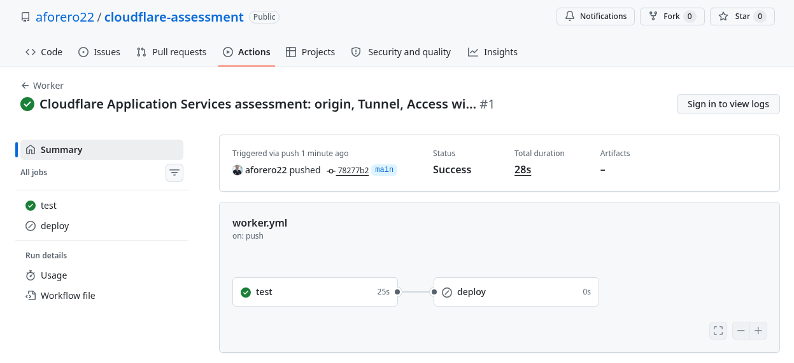

## 6. Use cases

| Feature | How a customer would use it |
|---|---|
| **Reverse proxy (orange cloud)** | Hide origin IPs, absorb DDoS, cache static content, apply WAF/bot rules and get analytics without touching the application. Typical first step when onboarding a website or API. |
| **Full (strict) + own certificate** | End-to-end encryption with certificate validation — required by PCI DSS / ISO 27001-style controls and by customers who already run a corporate or public PKI. Configuration Rules allow migrating host by host instead of a risky zone-wide switch. |
| **Authenticated Origin Pulls (per hostname)** | Cryptographic proof that a request came through *their* Cloudflare zone, so origins can stay internet-reachable (e.g. load balancers, SaaS backends) while refusing everything else. Per-hostname certificates let different apps use different PKIs. |
| **Cloudflare Tunnel** | Publish internal apps, legacy systems or apps behind NAT/CGNAT with **no inbound ports** and no public IP; connectors are outbound-only and redundant. Common for VPN replacement, dev/staging environments and branch apps. |
| **Access + IdP** | Zero Trust Network Access: per-application and per-path policies based on identity (Google, Okta, Entra), device posture or country, with audit logs. Replaces VPNs for employees and gives contractors/partners scoped access (e.g. OTP for external reviewers, as here). |
| **Workers** | Logic at the edge: personalize responses from the verified identity, enforce authorization, A/B tests, header manipulation, APIs — without changing or scaling the origin. |
| **R2** | S3-compatible object storage with no egress fees; private buckets served only through Workers (signed or authorized access), e.g. customer documents, media or software downloads. |

## 7. How I filled knowledge gaps

- **Official documentation first:** developers.cloudflare.com (SSL modes, AOP per-hostname setup, Tunnel
  HTTPS origins, Access application paths, Workers + Access JWT validation, R2 uploads) and the Cloudflare
  API reference for exact endpoints and payloads.
- **Terraform registry / provider docs (v5)** for resource names, schemas and import ID formats — v5
  renamed many resources compared with v4 examples found online.
- **Community content** (Cloudflare community, blog posts, dev.to articles) for practical patterns such as
  nginx mTLS with AOP and remotely-managed tunnels, always cross-checked against the docs.
- **Test-driven verification:** every assumption was checked with `curl`, `openssl s_client`, nginx logs,
  Access logs and Workers Observability — for example confirming that `/secure/*` alone does not protect
  `/secure`, and that the zone SSL mode does not apply to Tunnel traffic.
- **AI assistants** were used extensively: an AI agent drafted plans, code, scripts and documentation
  and executed many of the API calls and checks under my direction; independent AI reviews were used to
  audit the result. I reviewed the outputs and validated them against the documentation and live tests
  before keeping them.

Documentation used most (all on developers.cloudflare.com): SSL/TLS encryption modes and Configuration
Rules; Authenticated Origin Pulls (per-hostname); Cloudflare Tunnel (remotely-managed tunnels, origin
parameters `originServerName`/`noTLSVerify`); Access self-hosted applications and application paths;
Access JWT validation; Workers routes, R2 bindings and Wrangler configuration; R2 public buckets.

## 8. Customer experience and friction found

What felt smooth:
- Adding a proxied record and getting TLS at the edge is instantaneous.
- Remotely-managed tunnels: one token and `cloudflared service install`; the tunnel was healthy within seconds.
- Access in front of a path required no application change; the OTP login is simple for external users.
- Adding GitHub as an IdP took minutes and needed no change to the application, policy or Worker.
- Wrangler deploys in seconds and prints routes and bindings clearly; Workers Observability shows logs immediately.

Friction worth reporting (and how it was handled):
| Topic | Observation |
|---|---|
| Zone-wide settings on shared zones | SSL mode, Always Use HTTPS and zone-level AOP are zone-wide; on a zone with other production sites the safe path is Configuration Rules, Redirect Rules and per-hostname AOP. Discoverability of these scoped alternatives could be better. |
| Terraform provider v5 | Importing `cloudflare_authenticated_origin_pulls` does not populate `config`, so the first plan shows an in-place update (re-sending the same association). Ruleset resources own the entire phase entry point, which can delete dashboard-created rules if not careful. |
| Access path semantics | `/secure/*` does not cover `/secure`; two destinations are needed. Easy to miss. |
| AOP vs Tunnel | AOP does not apply to Tunnel traffic; mixing mTLS on the same listener would break `cloudflared`, hence a separate loopback listener. |
| Plans | The zone is on the Free plan and Zero Trust on the Free plan. The account also holds Workers Paid and R2 pay-as-you-go subscriptions from other projects (the dashboard shows a paid Workers plan banner); nothing in this assessment needs them — Configuration Rules, per-hostname AOP, Access (up to 50 users), Workers and R2 usage here all fit the free allowances. |
| Tooling versions | Wrangler 4 was run on Node.js 22; nginx 1.24 (Ubuntu 24.04) needs `listen … ssl http2` syntax instead of `http2 on`; Ubuntu's global `ssl_*` directives conflict with per-site duplicates. |
| Cloud provider | Smallest Azure B-series sizes (B1s/B1ms/B2s) had no capacity in Spain Central and one region was not accepting new resources; the deployment script falls back through a list of sizes. Azure CLI device-code login was blocked by tenant policy, so an interactive login in an isolated CLI profile was used. |
| Secret scanners | gitleaks flags the Access AUD tag as a generic key; it is a public identifier, documented and allow-listed. |
| IdP setup | The GitHub client ID was first retyped by hand with two look-alike characters (`0`/`O`, `I`/`l`); the IdP saved without any validation and the dashboard *Test* showed a GitHub 404. Fixed by correcting the ID and rotating the client secret. Lesson for customers: paste OAuth client IDs, and run the IdP *Test* right after saving (a format check at save time would help). |
| Tooling ownership | Wrangler and Terraform can both manage Worker routes; a Wrangler deploy replaced the route IDs Terraform had imported, which a plan revealed immediately. |

**Customer view.** For a customer team, the end-user experience is good: reviewers open a URL, type
their e-mail and a code, and land on the page without installing anything. The operator experience is
where the friction sits: zone-wide versus scoped settings on a shared zone, two tools able to own the
same Worker routes, and Terraform provider v5 import quirks. A Solutions Engineer onboarding this customer
should start from Configuration Rules and per-hostname controls, pick one owner per resource type, and run
a plan in CI after every change.

Overall, a target customer would find the building blocks powerful and quick to adopt; the main
learning curve is understanding which settings are zone-wide versus scoped, and how Access, Tunnel and
Workers compose on the same hostname.

## 9. Production recommendations

- **Terraform remote backend** with encryption and locking (access-restricted R2/S3 bucket or Terraform
  Cloud); state contains secrets. Run plans in CI with a scoped token; apply with approvals.
- **Certificate automation on the origin** (current certificate expires 30 December 2026; renewal is manual today): certbot (`dns-cloudflare` plugin) or acme.sh with a token
  limited to *Zone → DNS → Edit* on this zone only, stored root-only, with a deploy hook reloading nginx.
  Alternatively, Cloudflare Origin CA certificates when a public CA is not required.
- **Corporate IdP:** for employees, Google Workspace, Okta or Entra ID (GitHub here) with
  groups, plus device posture (WARP) and country rules for sensitive paths; keep OTP only for external
  guests.
- **Single owner for Worker routes** (Terraform), and R2 bucket public-access settings in Terraform.
- **Echo app hygiene:** the public header echo also reflects the visitor's own `Cookie` header (including
  their `CF_Authorization` cookie if they logged in on the same host); redact `Cookie` in a production
  echo service.
- **Logging:** Logpush of HTTP requests, Access and Workers logs to the SIEM; alerts on tunnel health,
  AOP certificate expiry and Access policy changes.
- **WAF and rate limiting:** managed rules in log mode first, then block; rate-limit `/secure*` and
  login flows; Bot Fight Mode where appropriate.
- **High availability:** at least two `cloudflared` replicas on different hosts; consider *Tunnel only*
  (close inbound 443 entirely) once the classic proxy path is no longer needed.
- **Least-privilege tokens** per tool (Terraform, Wrangler CI, certificate renewal) and rotation.

## 10. Appendix — test matrix

| # | Test | Expected | Result | Evidence |
|---|---|---|---|---|
| 1 | `curl https://68.221.177.94/` | fail | timeout | `01-direct-ip.txt` |
| 2 | `curl --resolve origin.iforecast.es:443:68.221.177.94 https://origin.iforecast.es/` | fail | timeout | `02-direct-ip-with-sni.txt` |
| 3 | From the VM: unknown SNI / correct SNI without client cert | reject | TLS alert / `400 No required SSL certificate` | `09-on-vm-checks.txt` |
| 4 | `curl https://origin.iforecast.es/` | 200 + headers | 200, `cf-connecting-ip`, `cf-ray` | `03-origin-via-cloudflare.txt` |
| 5 | `curl -I http://origin.iforecast.es/` | 301 | 301 | `04-origin-http-redirect.txt` |
| 6 | `curl https://tunnel.iforecast.es/` | 200 via tunnel | 200, `cf-warp-tag-id` | `05-tunnel-root.txt` |
| 7 | `curl -I https://tunnel.iforecast.es/secure` and `/secure/ES` | 302 to Access | 302 | `06`, `07` |
| 8 | Forged `Cf-Access-*` headers | 302 | 302 | `11` |
| 9 | workers.dev URL | not served | 404 | `11` |
| 10 | Browser login via OTP | identity page + flag | OK | `12-e2e-browser-login.txt` |
| 11 | Public DNS | Cloudflare IPs | OK | `08-dns-public.txt` |
| 12 | Worker unit tests | pass | 39/39 | CI |
| 13 | Terraform plan after apply | no changes | No changes | `terraform-plan-after.txt` |
| 14 | Terraform plan after the last Worker deploy and route re-import | no changes | No changes | `14-redeploy-and-plan.txt` |
| 15 | Login code requested for a mailbox outside the policy | denied | OK (no code sent, no access; candidate-run browser test, 2026-10-01) | `17-final-logins.txt` |
| 16 | Access login page offers GitHub; GitHub sign-in names the OAuth app | GitHub option, valid app | OK ("to continue to iforecast Cloudflare Access") | `15-github-idp.txt` |
| 17 | Full GitHub login through to `/secure` | identity page | OK (candidate-run browser test, 2026-10-01 18:17 Europe/Madrid; Access log method `github`) | `17-final-logins.txt` |
| 18 | `allowed_idps` = One-time PIN + GitHub, no instant redirect; login page shows both, e-mail button primary | both offered | OK (layout fixed by Cloudflare: GitHub button above the e-mail form) | `16-idp-order.txt` |

**Result: 18/18 passed.**
